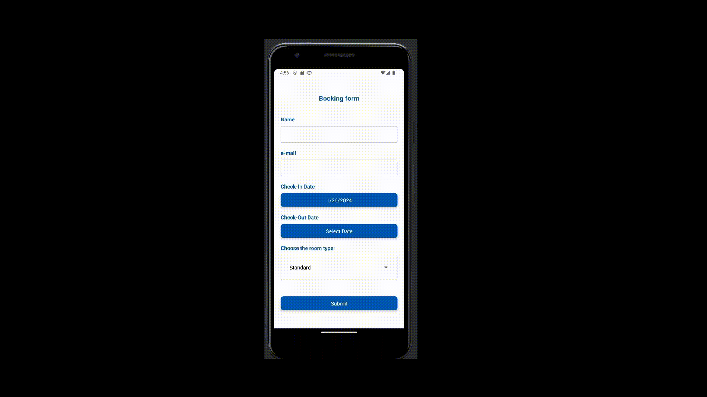

# React Native Handling user input, work with forms, Form validation (react hook form, Picker, DateTimePicker)

# Application

It is application for booking hotel room. User should input his name, email, choose check-in date and check-in date and choose room type. Available room types: **Standard**, **Luxury**, **Family**.

Validation rules for user inputs looks like:
  
Date validation looks like.
  
Correct data looks like:
   
